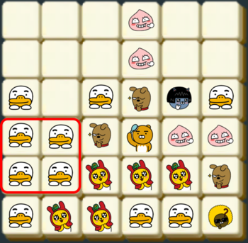

# 6. The Friends 4 Blocks
Ryan, the new crew who passed the blind recruitment, is on developing new games. At this time, it's "The Friends 4 Blocks"
If there are same 4 blocks in the form of 2x2, blocks are removed and you get points.

If there is a board above, 7 Ryan blocks and 4 Con blocks are removed. If there are multiple 2x2 blocks, they will be removed simultaneously.

After removing blocks, empty blocks will be filled with above blocks.

After this task, if there is 2x2 form again, continue removing and filling.

The string form of the first board is below

*TTTANT*
*RRFACC*
*RRRFCC*
*TRRRAA*
*TTMMMF*
*TMMTTJ*

Each letter means Ryan(*R*), Muzi(*M*), Apeach(*A*), Frodo(*F*), Neo(*N*), Tube(*T*), Jay-G(*J*), Con(*C*).

Develop the program to count the number of removing blocks with the first given board.

## input
- *m*, the height of the board, *n*, the width of the board, and *board*, the information of the board
- 2 <= *n*, *m* <= 30
- *board* is an array of *m* strings whose lengths are *n*. A to Z will be used for the block representation.

## output
- print the number of removing blocks

## example
1.
- *m* = 4
- *n* = 5
- *board* = ["CCBDE", "AAADE", "AAABF", "CCBBF"]
- answer = 14

2.
- *m* = 6
- *n* = 6
- *board* = ["TTTANT", "RRFACC", "RRRFCC", "TRRRAA", "TTMMMF", "TMMTTJ"]
- answer = 15

## explanation of example
- For the example 1, 6 A blocks will be removed at the first task. At the second task, 4 B blocks and 4 C blocks will be removed. Therefore, it's 14.
- For the example 2 is the case of the above text.