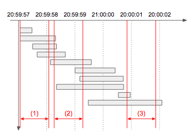

# 6. The Friends 4 Blocks
Apeach is considering increasing servers for Chuseok without having the system error. To decide it, Apeach is trying to analyze log data on 15th of September, the last Chuseok, and calculate the maximum capacity for one second. It means the maximum number of treating requests during any 1 second(1,000 milliseconds).

## input
- *lines* array, which is the input of *solution* function, N(1 <= N <= 2,000) log strings. Each log string has S, the request complete time, and T, the treating time. They are split with blank
- S, the request complete time, is the form of *2016-09-15 hh:mm:ss.sss*.
- T, the treating time, is like *0.1s*, *0.312s* or *2s*. The time has thousandths place value and *s* at the end.
- For example, *2016-09-15 03:10:33.020 0.011s* means the request from "2016-09-15 03:10:33.010" to "2016-09-15 03:10:33.020".
- 0.001 <= T <= 3.000 since the timeout of the server is 3 seconds.
- lines is in ascending power of S.

## output
- return the maximum number of trading requests during any 1 second in *lines*.

## example
1.
- lines : ["2016-09-15 01:00:04.001 2.0s", "2016-09-15 01:00:07.000 2s"]
- answer : 1

2.
- lines : ["2016-09-15 01:00:04.002 2.0s", "2016-09-15 01:00:07.000 2s"]
- answer : 2
- explanation : The first log is *01:00:02.003 ~ 01:00:04.002*, and the second log is *01:00:05.001 ~ 01:00:07.000*. During *01:00:04.002 ~ 01:00:05.001*, therefore, has 2 requests.

3. lines : ["2016-09-15 20:59:57.421 0.351s", "2016-09-15 20:59:58.233 1.181s", "2016-09-15 20:59:58.299 0.8s", "2016-09-15 20:59:58.688 1.041s", "2016-09-15 20:59:59.591 1.412s", "2016-09-15 21:00:00.464 1.466s", "2016-09-15 21:00:00.741 1.581s", "2016-09-15 21:00:00.748 2.31s", "2016-09-15 21:00:00.966 0.381s", "2016-09-15 21:00:02.066 2.62s"]
- answer : 7
- explanation : The picture would be helpful below. *(1)* has 4, *(2)* has 7 and *(3)* has 2 requests.

